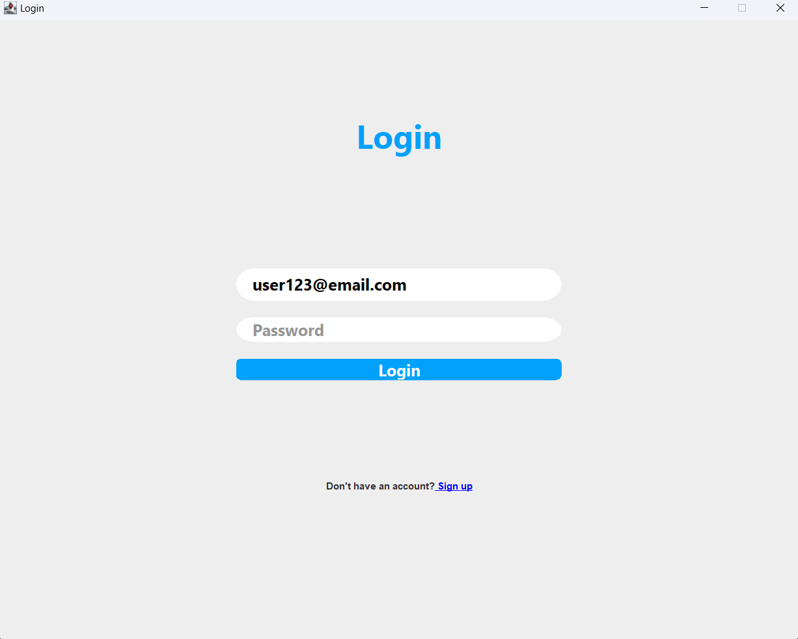
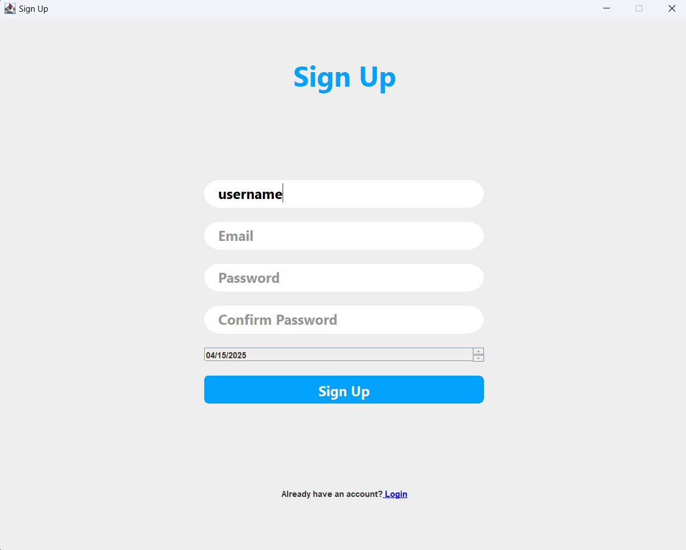
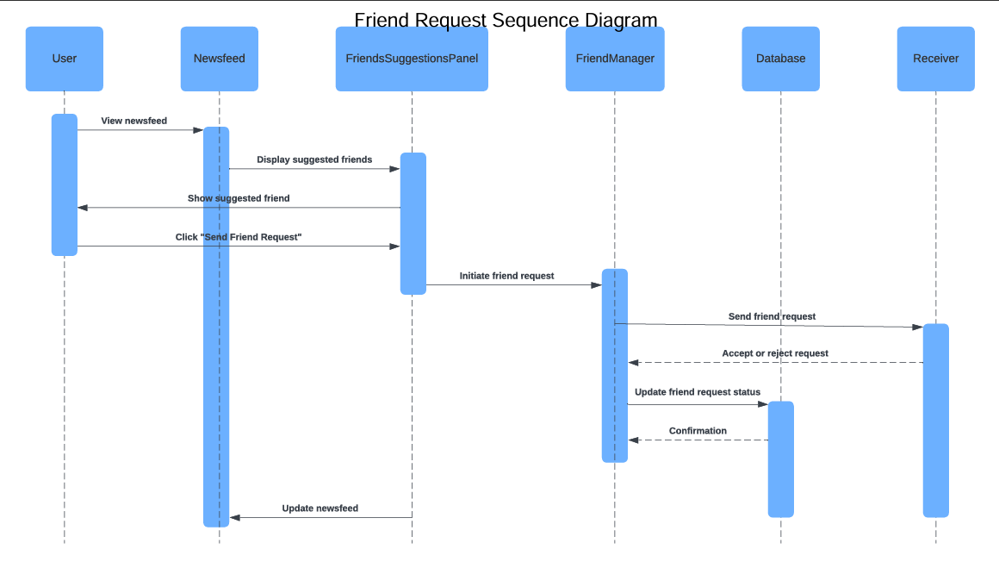
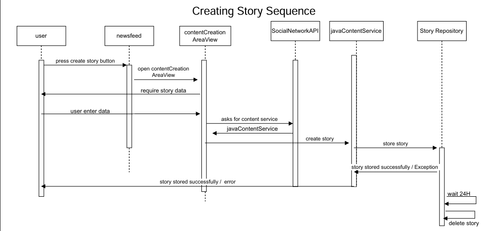
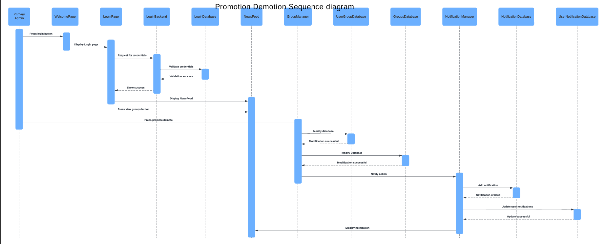
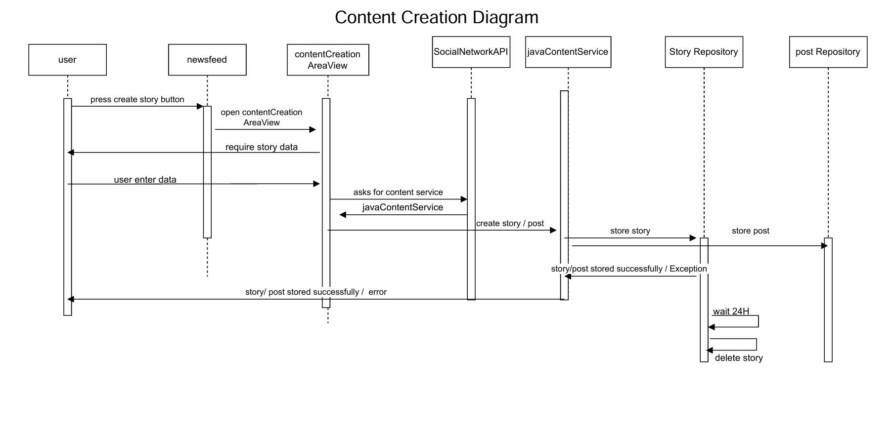
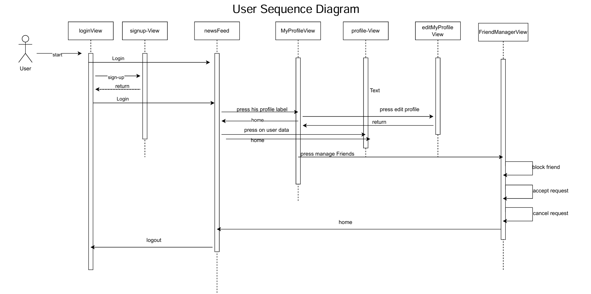
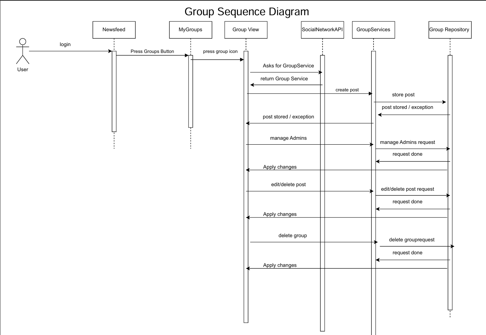
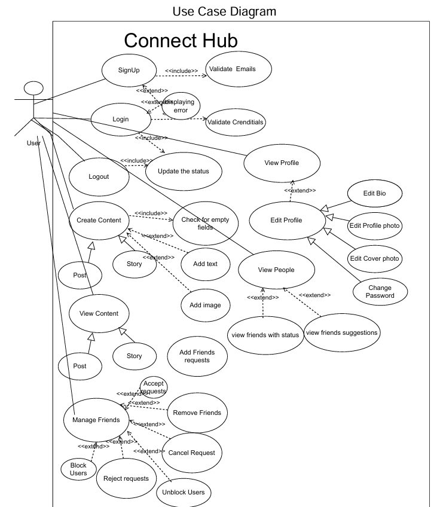
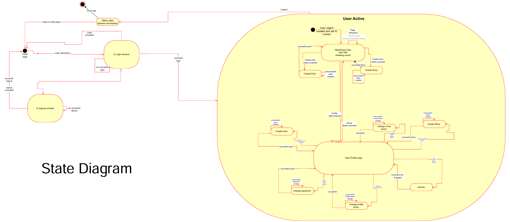

# Connect Hub

  

Connect Hub is a social networking platform developed as part of the CC272 Programming II course at Alexandria University. Built using Java and Swing, it provides a user-friendly interface for connecting people through features like user search, group management, chatting, post interactions, and real-time notifications. The application follows the MVC architecture, adheres to SOLID principles, and uses a file-based JSON database for data management. It incorporates multiple design patterns, Bcrypt for secure password hashing, and robust input validations to ensure a secure and efficient user experience.

## Screenshots

### Login Page
  
*The login page for user authentication with a "Sign Up" link for new users.*

### Sign Up Page
  
*The sign-up page allowing new users to register with a username, email, and password.*

## Table of Contents

- [Features](#features)
- [Technologies Used](#technologies-used)
- [Architecture and Design](#architecture-and-design)
- [Algorithms and Techniques](#algorithms-and-techniques)
- [UML Diagrams](#uml-diagrams)
- [Project Structure](#project-structure)
- [Prerequisites](#prerequisites)
- [Installation](#installation)
- [Running the Application](#running-the-application)
- [Contributing](#contributing)
- [License](#license)
- [Acknowledgments](#acknowledgments)

## Features

### Phase 1 (Assumed Foundation)
- **User Authentication**: Users can register and log in securely. Passwords are hashed using Bcrypt for enhanced security.
- **Profile Management**: Basic user profiles with details like username and email.
- **News Feed**: Displays posts and updates from friends and groups.

### Phase 2 Features
- **Search Functionality**:
  - **User Search**: Search for users by username, view their profiles, and perform actions like adding/removing friends or blocking users.
  - **Group Search**: Search for groups by name, join/leave groups, or view group details.
- **Group Management**:
  - **Group Creation**: Users can create groups with a name, description, and photo.
  - **Roles and Permissions**:
    - **Primary Admin**: Can promote/demote admins, remove members, manage posts, and delete the group.
    - **Other Admins**: Can approve/decline membership requests, remove normal members, and manage posts.
    - **Normal Users**: Can post content and leave groups.
  - **Group Deletion**: Groups are removed from a user’s news feed upon leaving.
- **Notification System**:
  - **Types**: Notifications for friend requests, group activities (e.g., new posts, member changes), and new posts in groups.
  - **Interaction**: Users can accept/decline friend requests or interact with group notifications directly from the news feed.
- **News Feed Enhancements**:
  - **Group Suggestions**: Suggests groups the user might be interested in.
  - **Interactive Notifications**: Displays actionable notifications in the news feed.
  - **Joined Groups**: Shows updates from groups the user is a member of.

### Phase 3 Features
- **Chatting**:
  - Users can send messages to friends, with conversations stored and accessible.
- **Interacting with Posts**:
  - **Comments**: Users can add multiple comments to a post, and comments are stored for all users to see.
  - **Notifications**: Users receive notifications for new comments or likes on their posts.
- **Enhanced Notification System**:
  - **Real-Time Notifications**: Supports real-time updates for messages and post interactions using threads or WebSocket technology (implementation choice left to the developer).
  - **Frontend Integration**: Users can interact with notifications (e.g., accept/decline friend requests, respond to group notifications).
- **Additional Features**:
  - Filtering expired stories, managing friend requests, and fetching user statuses efficiently.

## Technologies Used

- **Java**: Version 17
- **Swing**: For building the graphical user interface
- **JSON**: File-based database for data storage
- **Bcrypt**: For secure password hashing
- **Git**: For version control

## Architecture and Design

- **MVC Architecture**:
  - **Model**: Represents data entities (e.g., `User`, `Group`, `Post`, `Notification`) and handles JSON file operations.
  - **View**: Swing-based GUI components for user interaction (e.g., login, sign-up, news feed).
  - **Controller**: Manages user inputs, updates the model, and refreshes the view.
- **SOLID Principles**:
  - **Single Responsibility**: Each class has a single purpose (e.g., `UserService` handles user-related logic).
  - **Open/Closed**: Classes are open for extension but closed for modification (e.g., adding new notification types).
  - **Liskov Substitution**: Subclasses (e.g., `Admin` vs. `NormalUser`) can replace their parent without affecting functionality.
  - **Interface Segregation**: Interfaces are specific to client needs (e.g., `GroupAdminOperations` vs. `UserOperations`).
  - **Dependency Inversion**: High-level modules depend on abstractions (e.g., services use interfaces for data access).
- **Design Patterns**:
  - **Creational**:
    - **Singleton**: Ensures a single instance of the `DatabaseManager` for JSON file access.
    - **Factory Method**: Creates different types of notifications (e.g., `FriendRequestNotification`, `PostCommentNotification`).
  - **Structural**:
    - **Adapter**: Adapts the JSON file format to the application’s data model.
    - **Facade**: Simplifies complex interactions with the notification system via a unified interface.
  - **Behavioral**:
    - **Observer**: Implements the notification system, where users are notified of events (e.g., new comments, messages).
    - **Strategy**: Handles different search algorithms for users and groups.
    - **Command**: Encapsulates actions like joining/leaving groups as commands for easy execution and undoing.

## Algorithms and Techniques

- **Password Hashing**:
  - **Technique**: Uses Bcrypt to hash passwords, ensuring secure storage with a slow hashing algorithm to resist brute-force attacks.
- **Search Functionality**:
  - **Algorithm**: Linear search through the JSON file for usernames and group names. Could be optimized with indexing for larger datasets.
  - **Technique**: Filters results based on user input, supporting partial matches.
- **Notification System**:
  - **Technique**: Real-time updates using either threads (polling JSON files periodically) or WebSocket for live notifications.
  - **Observer Pattern**: Users subscribe to events (e.g., new comments, messages), and the system notifies them accordingly.
- **Input Validation**:
  - **Technique**: Validates all user inputs (e.g., username, email, password) using regular expressions and custom rules.
  - **Algorithm**: Rule-based validation (e.g., email must match a regex pattern, passwords must meet length and complexity requirements).
- **Data Storage**:
  - **Technique**: Stores data in JSON files, with structures designed to minimize redundancy and improve access speed.
  - **Optimization**: Links user IDs to content (e.g., posts, messages) to efficiently manage relationships.
- **Group Management**:
  - **Technique**: Role-based access control (RBAC) to manage permissions for primary admins, other admins, and normal users.
  - **Algorithm**: Hierarchical permission checking to determine user capabilities within a group.

## UML Diagrams

The following UML diagrams illustrate the design and flow of the Connect Hub application. They provide insights into user interactions, system processes, and state transitions.

### Friend Request Sequence Diagram
  
*Illustrates the process of sending and accepting/rejecting a friend request, involving the user, newsfeed, friends suggestions panel, friend manager, database, and receiver.*

### Creating Story Sequence Diagram
  
*Depicts the process of creating a story, from user input to storage in the story repository, including a 24-hour expiration mechanism.*

### Promotion/Demotion Sequence Diagram
  
*Shows the flow for promoting or demoting a group member, including authentication, modification, and notification updates.*

### Content Creation Sequence Diagram
  
*Outlines the steps for creating content (story or post), from user input to storage in the respective repositories.*

### User Sequence Diagram
  
*Describes the user’s interaction flow, including login, signup, viewing profiles, editing profiles, managing friends, and logging out.*

### Group Sequence Diagram
  
*Details the group management process, including creating posts, managing admins, editing/deleting posts, and deleting groups.*

### Use Case Diagram
  
*Represents the main functionalities of Connect Hub, such as signing up, logging in, managing friends, creating content, and editing profiles.*

### State Diagram
  
*Illustrates the state transitions of the application, from login to user activities like creating posts, editing profiles, and logging out.*

## Project Structure

```
Connect-Hub/
├── src/
│   ├── main/
│   │   ├── java/
│   │   │   ├── com/
│   │   │   │   ├── connecthub/
│   │   │   │   │   ├── model/
│   │   │   │   │   │   ├── User.java
│   │   │   │   │   │   ├── Group.java
│   │   │   │   │   │   ├── Post.java
│   │   │   │   │   │   ├── Notification.java
│   │   │   │   │   │   ├── Message.java
│   │   │   │   │   ├── view/
│   │   │   │   │   │   ├── LoginView.java
│   │   │   │   │   │   ├── SignupView.java
│   │   │   │   │   │   ├── NewsFeedView.java
│   │   │   │   │   ├── controller/
│   │   │   │   │   │   ├── LoginController.java
│   │   │   │   │   │   ├── SignupController.java
│   │   │   │   │   │   ├── NewsFeedController.java
│   │   │   │   │   ├── service/
│   │   │   │   │   │   ├── UserService.java
│   │   │   │   │   │   ├── GroupService.java
│   │   │   │   │   │   ├── NotificationService.java
│   │   │   │   │   ├── util/
│   │   │   │   │   │   ├── DatabaseManager.java
│   │   │   │   │   │   ├── PasswordUtil.java
│   │   │   │   │   ├── Main.java
│   │   ├── resources/
│   │   │   ├── images/
│   │   │   │   ├── login_page.png
│   │   │   │   ├── signup_page.png
│   │   │   │   ├── friend_request_sequence_diagram.png
│   │   │   │   ├── creating_story_sequence_diagram.png
│   │   │   │   ├── promotion_demotion_sequence_diagram.png
│   │   │   │   ├── content_creation_sequence_diagram.png
│   │   │   │   ├── user_sequence_diagram.png
│   │   │   │   ├── group_sequence_diagram.png
│   │   │   │   ├── use_case_diagram.png
│   │   │   │   ├── state_diagram.png
│   │   │   ├── data/
│   │   │   │   ├── users.json
│   │   │   │   ├── groups.json
│   │   │   │   ├── posts.json
│   │   │   │   ├── notifications.json
│   │   ├── test/
│   │   │   ├── java/
│   │   │   │   ├── com/
│   │   │   │   │   ├── connecthub/
│   │   │   │   │   │   ├── service/
│   │   │   │   │   │   │   ├── UserServiceTest.java
├── README.md
├── LICENSE
├── .gitignore
```

- `model/`: Defines data entities like `User`, `Group`, and `Notification`.
- `view/`: Swing-based GUI components for the frontend.
- `controller/`: Handles user interactions and updates the model/view.
- `service/`: Implements business logic (e.g., user management, notifications).
- `util/`: Utility classes like `DatabaseManager` for JSON operations and `PasswordUtil` for Bcrypt hashing.
- `resources/data/`: Stores JSON files for the database.
- `resources/images/`: Contains screenshots and UML diagrams for the `README.md`.

## Prerequisites

- **Java Development Kit (JDK)**: Version 17 or higher.
- **IDE**: IntelliJ IDEA, Eclipse, or VS Code with Java extensions (optional but recommended).
- **Git**: To clone the repository.

## Installation

1. **Clone the Repository**:
   ```bash
   git clone https://github.com/MostafaAbdulazziz/Connect-Hub.git
   cd Connect-Hub
   ```

2. **Verify Java Version**:
   ```bash
   java -version
   ```
   Ensure output shows Java 17 or higher.

3. **Set Up the JSON Database**:
   - Ensure the `resources/data/` directory contains JSON files (`users.json`, `groups.json`, `posts.json`, `notifications.json`).
   - If not present, create empty JSON files with the following structure:
     ```json
     // users.json
     {
       "users": []
     }
     // groups.json
     {
       "groups": []
     }
     // posts.json
     {
       "posts": []
     }
     // notifications.json
     {
       "notifications": []
     }
     ```

4. **Add the UML Diagrams**:
   - Ensure the `resources/images/` directory contains the UML diagrams with the following filenames:
     - `friend_request_sequence_diagram.png`
     - `creating_story_sequence_diagram.png`
     - `promotion_demotion_sequence_diagram.png`
     - `content_creation_sequence_diagram.png`
     - `user_sequence_diagram.png`
     - `group_sequence_diagram.png`
     - `use_case_diagram.png`
     - `state_diagram.png`

## Running the Application

1. **Compile and Run**:
   - If using an IDE, open the project and run `Main.java`.
   - Alternatively, compile and run from the terminal:
     ```bash
     javac -d . src/main/java/com/connecthub/*.java src/main/java/com/connecthub/**/*.java
     java com.connecthub.Main
     ```

2. **Access the Application**:
   - The application will launch a Swing window displaying the login page.
   - Use default credentials (e.g., username: `user123`, password: `password123`) if pre-populated in `users.json`, or sign up as a new user.
   - Navigate to the news feed to interact with features like searching, joining groups, chatting, and viewing notifications.

## Contributing

We welcome contributions to enhance Connect Hub! To contribute:

1. Fork the repository.
2. Create a new branch (`git checkout -b feature/your-feature`).
3. Make your changes and commit (`git commit -m "Add your feature"`).
4. Push to your branch (`git push origin feature/your-feature`).
5. Open a pull request with a clear description of your changes.

Please follow the [Code of Conduct](CODE_OF_CONDUCT.md) and ensure tests (if any) pass.

## License

This project is licensed under the [MIT License](LICENSE). See the [LICENSE](LICENSE) file for details.

## Acknowledgments

- Developed by Mostafa Abdul Aziz as part of the CC272 Programming II course at Alexandria University.
- Supervised by Dr. Layla Abou-Hadeed and teaching assistants.
- Thanks to the open-source community for tools and libraries.
